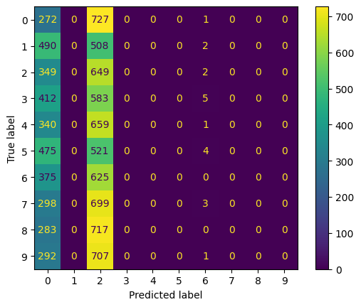
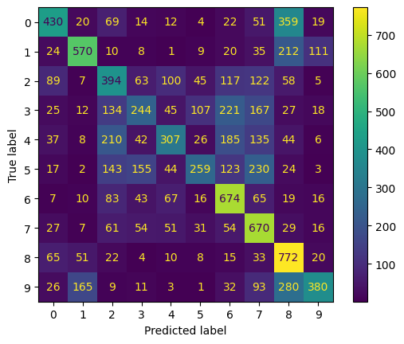
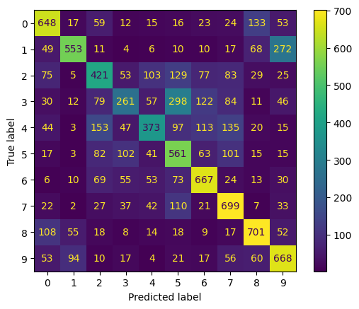
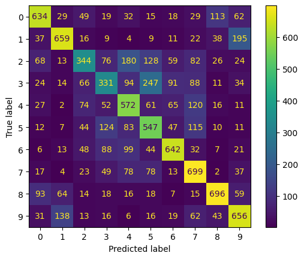
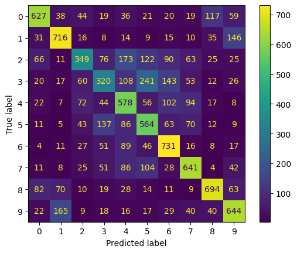
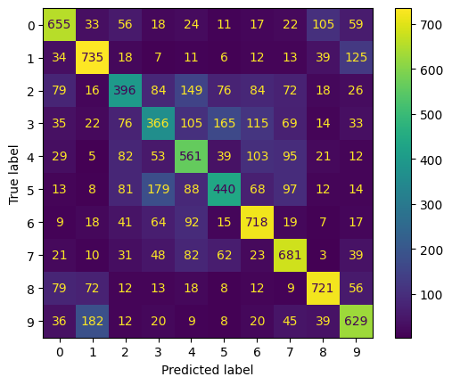

# Federated-Learning-on-CIFAR10
This is a project I made while learning the fundamentals of Federated learning. The aim of the project was to implement federated learning on the CIFAR10 dataset using CNN with a fixed number of clients so that there is no raw data transferred between the server and the clients. I used the [Flower's Pytorch tutorial] (https://flower.ai/docs/framework/tutorial-series-use-a-federated-learning-strategy-pytorch.html) and [Flower's Differential Privacy tutorial] (https://flower.ai/docs/framework/how-to-use-differential-privacy.html) as guides for this project. I ran the model for 5 rounds and seven epochs, evaluating the model after every round. The Results can be seen in the notebook file or the Results section of the attached PDF file.

Here are the confusion matrices for the 5 rounds:

### Round 0, before the training began

### After 1. round

### After 2. round

### After 3. round

### After 4. round

### After 5. round

